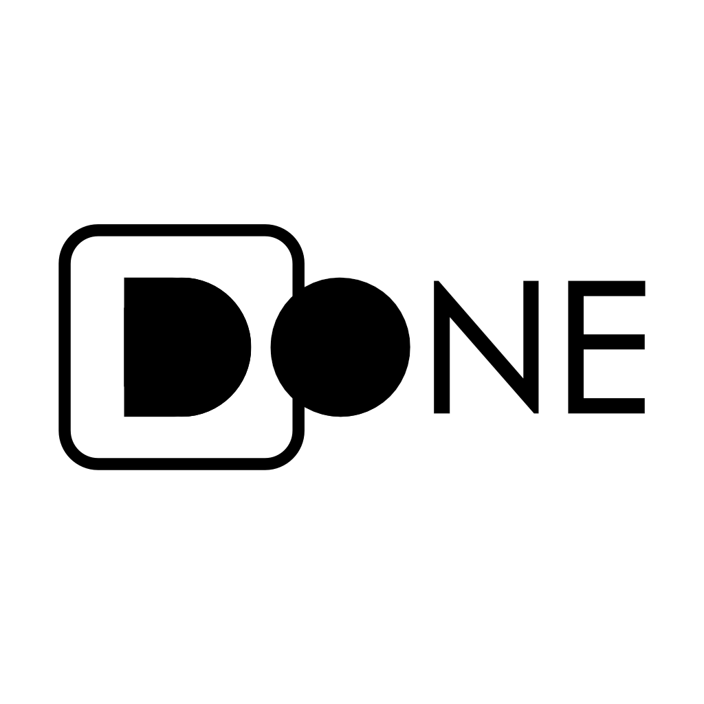

<p align="center">
  
</p>

**DONE** is a context-aware productivity ecosystem consisting of a minimalist macOS desktop overlay and a companion mobile remote. It monitors your active application and uses local AI (via Ollama) to suggest relevant keyboard shortcuts and actions.

## ✨ Features

- **Real-time Monitoring**: Automatically detects active apps, browser URLs, and page titles.
- **Mobile Remote**: Control your Mac shortcuts directly from your phone with a zero-latency UDP link.
- **Smart Browser Caching**: Strips URL query parameters to provide instant actions across similar web contexts (e.g., any YouTube video).
- **Extended Keyboard Support**: Full support for F1-F12, navigation keys, and complex modifier chords.
- **Boomerang Focus**: Executes shortcuts by temporarily focusing the target app and immediately returning to your work.
- **Automated CI/CD**: Dual-platform builds (Mac & Android) delivered via GitHub Actions.

## 🛠️ Technical Stack

- **Desktop**: Python 3.14, PyQt6, pynput
- **Mobile**: Flutter 3.41.9, Material 3
- **AI**: Ollama (Local LLM)

## 🚀 Installation & Setup

### **Option 1: Download the Release (Recommended)**

1. Go to the [Releases](https://github.com/yourusername/done/releases) page.
2. Download `DONE-desktop.zip` (for Mac) and `DONE.apk` (for Android).
3. On Mac: Move `DONE.app` to your `/Applications` folder.
4. On Android: Install the APK on your phone.

### **Option 2: Developer Setup**

1. **Clone the repository**.
2. **Desktop**:
   ```bash
   python3 -m venv venv
   source venv/bin/activate
   ```
3. **Install dependencies**:
   ```bash
   pip install -r requirements.txt
   ```
4. **Run the script**:
   ```bash
   python3 main.py
   ```

## 🛠 Building the .app Bundle

To package the script into a standalone macOS application:

1. Ensure `py2app` is installed: `pip install py2app`
2. Run the build script:
   ```bash
   python3 build.py py2app
   ```
3. Your app will be located in the `dist/` folder.

## ⚠️ Important Note on Permissions

Since **DONE** automates keystrokes and monitors window titles, macOS requires specific permissions:

- **Accessibility**: Required to simulate keyboard events and query window states.
- **Automation**: Required for the terminal/app to control browsers (Chrome, Safari, etc.).

## 📝 License

Copyright © 2026 irfnyas. Licensed under the Apache License, Version 2.0.
